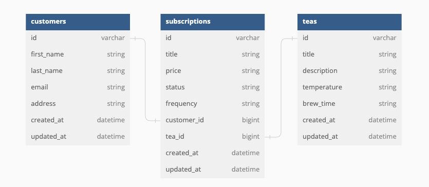

# Tea Time Subscription Service
This repository was created to satisfy the requirements of an 8 hour take home challenge. Tea Time Subscription Service is an SOA application following Restful convention for developer empathy and for ease of API consumption. This repo offers a front end application 3 endpoints to utilize. Creating a subscription, deactivating a subscription, and viewing a customer's subscriptions.
More details below.

## Built With
* 
* 
* 
* 
* 

## Running On
  - Rails 7.0.6
  - Ruby 3.2.2

## <b>Getting Started</b>

To get a local copy, follow these simple instructions

### <b>Installation</b>

1. Fork the Project
2. Clone the repo 
``` 
git clone git@github.com:sicknacco/tea_time.git 
```
3. Install the gems
```
bundle install
```
4. Create the database
```
rails db:{create,migrate}
```

5. Run test suite (All tests should be passing at 100%)
```
bundle exec rspec
```


## Database Design



## Endpoints

### GET `/api/v0/customers/:customer_id/subscriptions`
___
#### Response:
```
{ "data": [
        {
            "id": "68",
            "type": "subscription",
            "attributes": {
                "title": "Tea Good One",
                "price": "19.99",
                "status": "active",
                "frequency": "monthly",
                "tea_id": 33,
                "customer_id": 10
            }
        },
        {
            "id": "42",
            "type": "subscription",
            "attributes": {
                "title": "The Okay One",
                "price": "15.95",
                "status": "active",
                "frequency": "monthly",
                "tea_id": 8,
                "customer_id": 10
            }
        },
        {
            "id": "71",
            "type": "subscription",
            "attributes": {
                "title": "The Bad One",
                "price": "25.99",
                "status": "inactive",
                "frequency": "monthly",
                "tea_id": 75,
                "customer_id": 10
            }
        }        
    ]
}
```

### POST `/api/v0/subscriptions`
___
#### Request body:
```
{
  "title": "Black Tea Subsciption"
  "price": "10.00",
  "status": "active",
  "frequency": "monthly",
  "customer_id": 1,
  "tea_id": 4,
}
```

#### Response:
```
{
  "data": {
      "id": "27",
      "type": "subscription",
      "attributes": {
          "title": "Black Tea Subscription",
          "price": "10.00",
          "status": "active",
          "frequency": "monthly",
          "customer_id": 1
          "tea_id": 4,
      }
   }
}
```

### PUT `api/v0/subscriptions/:sub_id`
___
#### Response:
```
{
  "data": {
      "id": "27",
      "type": "subscription",
      "attributes": {
          "title": "Black Tea Subscription",
          "price": "10.00",
          "status": "inactive",
          "frequency": "monthly",
          "customer_id": 1
          "tea_id": 4,
      }
   }
}
```

#### Example Error Responses:
```
{ :error=>"Subscription is already inactive" }

{ :error=>"Customer must exist and Customer can't be blank" }

{ :error=>"Tea must exist and Tea can't be blank" }
```

## Refactors
- Currently the 'update' action in the subscriptions controller only updates a subscription from active to inactive due to the challenge requirements.
If given more time, I would refactor that action to allow updating to all relevant attributes.
- The 'status' attribute is currently any string. Ideally I would use an enum and set the default status to 'active'. Tests still only allow for 'active' and 'inactive' values.

## Author
- Nick Sacco [ ](https://github.com/sicknacco) [ ](https://www.linkedin.com/in/nick-sacco/)

## Planning Tools
- [ ](https://github.com/users/sicknacco/projects/10)